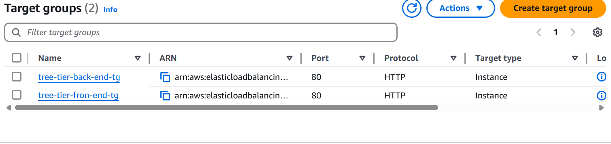
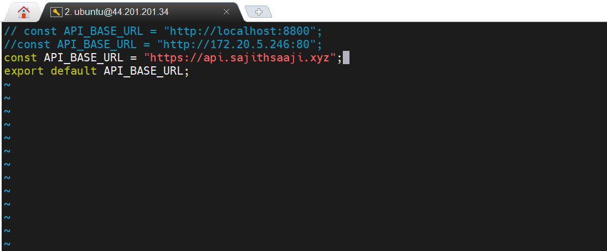

# 3 Tier Project

# Steps
* Create One VPC with cide range (10.20.0.0/16)
    * Name of VPC `3-tier-vpc`
* Create one seurity group
    * Name `tree-tier-sg`
* Create One IGW and attach to VPC (3-tier-vpc)
    * Name of IGW `Three-tier-IGW` attach to  `3-tier-vpc`
* Create `Eight` Subnetes
    * `Two` subnetes are `public`
    * `Six` subnetes are `private`
        * Names of public  subnets `1a` and `2b`
            * `pub-sub-1a` availability zone is `us-east-1a` and CID `10.20.1.0/24`
            * `pub-sub-2b` availability zone is `us-east-1b` and CID `10.20.2.0/24`
        * Names of private subnetes `3a` , `4b` , `5a` , `6b` , `7a` , `8b` 
            * `pvt-sub-3a` availability zone is `us-east-1a` and CID `10.20.3.0/24`
            * `pvt-sub-4b` availability zone is `us-east-1b` and CID `10.20.4.0/24`
            * `pvt-sub-5a` availability zone is `us-east-1a` and CID `10.20.5.0/24`
            * `pvt-sub-6b` availability zone is `us-east-1b` and CID `10.20.6.0/24`
            * `pvt-sub-7a` availability zone is `us-east-1a` and CID `10.20.7.0/24`
            * `pvt-sub-8b` availability zone is `us-east-1b` and CID `10.20.8.0/24`
    

* Create Two Route Tables one is `public` another one is `private`
    * Name of Pub-RT `three-tier-pub-rt` and attach to `3-tier-vpc`
    * Name of the Pvt-RT `three-tier-pvt-rt` and attach to `3-tier-vpc`
    
* After creation of Subnetes and Route Tabels we need to do `Subnet Associations`
    * We need to Attach IGW to public Route tabel
        
    * Public subnetes for Public Route Tabel
        
    * Private subnetes for Private Route Tabel
        
* Create Subnet group for `pvt-sub-7a`, `pvt-sub-8b` beacuse we can create Data base in these two availability zones for High Availability. 
* Go to RDS and create Subenet Group 
    * Name of the subnet group `three-tier-sub-gr`
    
* Create Data Base
    * Standard create 
    * Engine Option : `MySQL`
    * Template: `Dev/Test`
    * Availability and durability: `Multi-AZ DB instance deployment`
    * Credentials management: `self managed` and select `Auto generated password`
    * Addition storage configuartion Unselect `Enable storage autoscaling`
    * VPC : `3-tier-vpc`
    * VPC security group : `tree-tier-sg`
    * Additional Configuartion
        * Initial database name: `test`
    * Unselect the `Backup` and `Encryption` and `Maintenance`
    * Create Database
        * `End point`database-1.cu1ow4uegp96.us-east-1.rds.amazonaws.com --> In real time it contains one record also because internaly hosted zones
        
* Goto Route 53 and create one `HostedZone`
    * Created hosted zones
        * Domain Name: `sajithsaaji.xyz`
        * Type: `public hosted zone`
        
        * In this case we need to add NS records on Godady nameserever
        
    * And create another hosted zone that is private
        * Domain name : `rds.com`
        * Type: `private hosted zone` 
        * It means with VPC how to go traffic backend server to data base
        * VPCs to associate with hosted zone
            * Region:  `N.Virginia`
            * Vpc id: `3-tier-vpc`
            * In private hosted zone we need to create a one record. That record shoud point to this `rds` instance
                * Create record
                    * Record name: `book.rds.com`
                    * Record type: CNAME
                    * Value: `database-1.cu1ow4uegp96.us-east-1.rds.amazonaws.com` # it is a database end point
                    * Create record

* Create Two Load Balancers One for `Front-end` and Another for `Back-end`
* Before that we need to create TWO Target group
    * Basic configurartion: `Instances`
    * Target group name: `tree-tier-fron-end-tg`
    * VPC: `3-tier-vpc`
    * // Second target group
    * Basic configurartion: `Instances`
    * Target group name: `tree-tier-back-end-tg`
    * VPC: `3-tier-vpc`
    
* Go to Load Balancer
    * ALB
    * Load balancer name: `front-end-alb`
    * Network mapping 
        * VPC : `3-tier-vpc`
        * Availability zones : `us-east-1a (pub-sub-1a)` & `us-east-1b(pub-sub-2b)`
        * Security group: `tree-tier-sg`
        * Listeners and Routing : `tree-tier-fron-end-tg`
    * // second Load balancer
    * Load balancer name: `back-end-alb`
    * Network mapping 
        * VPC : `3-tier-vpc`
        * Availability zones : `us-east-1a (pub-sub-1a)` & `us-east-1b(pub-sub-2b)`
        * Security group: `tree-tier-sg`
        * Listeners and Routing : `tree-tier-back-end-tg`
        * create
        
* Create Certificate for Security purpose
    * Go to Certificate manager
        * Request
        * Fully qualified domain name : `sajithsaaji.xyz`
        * Create and select records in Route 53
        
* Go to front-end ALB `front-end-alb`
    * Listeners and rules: `Add listeners`
    * protocol : `HTTPS`
    * Target group: `front-end-alb`
    * Certificate(from ACM) : `sajithsaaji.xyz`
    

\\\ Create 2 Ubuntu servers for creating Lunch template
* Fornt-end server
```bash
Create one tem ubuntu server
# User data
#!/bin/bash
sudo apt update -y
sudo apt install apache2 -y
curl -fsSL https://deb.nodesource.com/setup_18.x | sudo -E bash - &&\
sudo apt-get install -y nodejs -y
sudo apt update -y 
sudo npm install -g corepack -y
corepack enable
corepack prepare yarn@stable --activate
sudo npm install -g pm2 

git clone https://github.com/Ramani-github/aws_three_tier_project.git
cd aws_three_tier_proje/client
vi src/pages/config.js --> In this file we need to add our domain name
#const API_BASE_URL = "http://172.20.5.246:80";
const API_BASE_URL = "https://api.sajithsaaji.xyz"; --> we need to create one record in route 53(connection of backend)
sudo npm install
sudo npm run build  --> while execute this command build folder will be created
sudo cp -r build/* /var/www/html/

```
* This images are related front-end server




* backend server
```bash
#!/bin/bash
sudo apt update -y
sudo apt install apache2 -y
curl -fsSL https://deb.nodesource.com/setup_18.x | sudo -E bash - &&\
sudo apt-get install -y nodejs -y
sudo apt update -y 
sudo npm install -g corepack -y
corepack enable
corepack prepare yarn@stable --activate
sudo yarn global add pm2
#sudo npm install -g pm2
sudo git clone https://github.com/Ramani-github/aws_three_tier_project.git
cd /aws_three_tier_project/backend/
cp sudo cp .env.example .env
sudo vi .env
# in this file we need to add database connection
sudo npm install
sudo npm install dotenv

## Now start the backend server or connect data base
sudo pm2 start index.js --name "backendApi"
sudo pm2 list
```


* After completion of front-end and back-end set-up we need to create `Templates` for creation `Application Load Balancer`
    * Select `front-end` server
        * Actions
            * Image and Templates
                * create image
                    * Name: `three-tier-front-end-tm`
                        * create 
* Image template for back-end server
    * Select `back-end` server
        * Actions
            * Image and Templates
                * create image
                    * Name: `three-tier-back-end-tm`
                        * create

* Go to Lunch template
    * Create lunch template
        * lunch template name: `front-end-TM`
    * Application and OS images
        * My AMIs
            * Owned by me: `three-tier-front-end-tm`
         ```bash
            # user data
            #!/bin/bash
            sudo apt update -y
            sleep 90
            sudo systemctl start apache2.service
        ```
    * Create another lunch template for backend server
         * Create lunch template
            * lunch template name: `back-end-TM`
    * Application and OS images
        * My AMIs
            * Owned by me: `three-tier-back-end-tm`
        ```bash
            #!/bin/bash
            sudo apt update -y
            sudo pm2 startup
            sudo env PATH=$PATH:/usr/bin/ /usr/bin/pm2 startup systemd -u ubuntu --hp /home/ubuntu
            sudo systemctl start pm2-root
            sudo systemctl enable pm2-root
        ```


* Finally create Two Auto Scaling Groups (front-end and Back-end)
* Go to ASG
    * Name: `ASG-front-end`
* Launch template  
    * `fornt-end-TM`
* Network
    * VPC:`3-tier-vpc`
    * Availability: `pvt-sub-3a` and `pvt-sub-4b`
* Load balancing 
    * Attach to an existing load balancer
        * `tree-tier-fron-end-tg`
* // create send aASG
* Go to ASG
    * Name: `ASG-back-end`
* Launch template  
    * `back-end-TM`
* Network
    * VPC:`3-tier-vpc`
    * Availability: `pvt-sub-a5` and `pvt-sub-6b`
* Load balancing 
    * Attach to an existing load balancer
        * `tree-tier-back-end-tg`
